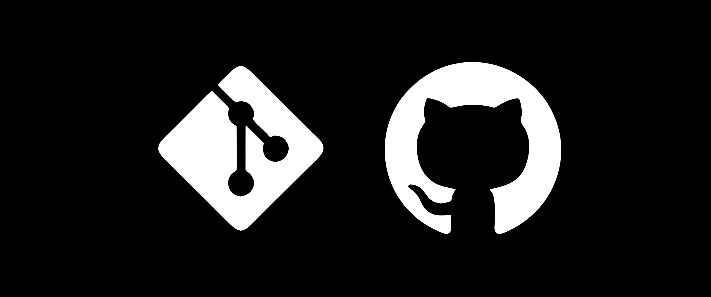

# 📚 Git Course Archive

Welcome to the **Git Course Archive**, a comprehensive collection of notes from the Sabzlearn Git course. This repository organizes key concepts, commands, and best practices for using Git, GitHub, GitLab, and Git Flow, making it an ideal resource for learners and developers.

## 🧭 Table of Contents

- [About The Repository](#about-the-repository)
- [Lessons](#lessons)
- [Technologies Covered](#technologies-covered)
- [Social Media](#social-media)
- [Feedback](#feedback)

<h2 id="about-the-repository">⁉️ About The Repository</h2>

This repository archives detailed notes from the Sabzlearn Git course, covering essential Git workflows, commands, and collaboration techniques. Each lesson is stored in the `lessons` folder as a Markdown file, providing clear explanations and practical examples for mastering version control.

<h2 id="lessons">📝 Lessons</h2>

Below is a list of lessons with links to their respective Markdown files in the `lessons` folder:

| Episode | Title | Link |
|:-:|:-:|:-:|
| 5 | Git Basics | [View Lesson](./lessons/Episode_5_Git_Basics.md) |
| 7 | Initializing Git | [View Lesson](./lessons/Episode_7_Initializing_Git.md) |
| 8 | Git Status and File States | [View Lesson](./lessons/Episode_8_Git_Status_and_File_States.md) |
| 9 | Removing Files from Staging | [View Lesson](./lessons/Episode_9_Removing_Files_from_Staging.md) |
| 10 | Git Commit | [View Lesson](./lessons/Episode_10_Git_Commit.md) |
| 11 | Viewing Commit History | [View Lesson](./lessons/Episode_11_Viewing_Commit_History.md) |
| 12 | Git Log Flags | [View Lesson](./lessons/Episode_12_Git_Log_Flags.md) |
| 13 | Combining Add and Commit | [View Lesson](./lessons/Episode_13_Combining_Add_and_Commit.md) |
| 14 | Viewing Commit Details | [View Lesson](./lessons/Episode_14_Viewing_Commit_Details.md) |
| 15 | Git Aliases | [View Lesson](./lessons/Episode_15_Git_Aliases.md) |
| 16 | Introduction to Branches | [View Lesson](./lessons/Episode_16_Introduction_to_Branches.md) |
| 17 | Managing Branches | [View Lesson](./lessons/Episode_17_Managing_Branches.md) |
| 18 | Deleting and Creating Branches | [View Lesson](./lessons/Episode_18_Deleting_and_Creating_Branches.md) |
| 19 | Branch Management | [View Lesson](./lessons/Episode_19_Branch_Management.md) |
| 20 | GitLens Extension | [View Lesson](./lessons/Episode_20_GitLens_Extension.md) |
| 21 | Fast-Forward Merge | [View Lesson](./lessons/Episode_21_Fast_Forward_Merge.md) |
| 22 | Non-Fast-Forward Merge | [View Lesson](./lessons/Episode_22_Non_Fast_Forward_Merge.md) |
| 23 | Resolving Merge Conflicts | [View Lesson](./lessons/Episode_23_Resolving_Merge_Conflicts.md) |
| 24 | Best Practices for Merging | [View Lesson](./lessons/Episode_24_Best_Practices_for_Merging.md) |
| 25 | Semantic Commit Messages | [View Lesson](./lessons/Episode_25_Semantic_Commit_Messages.md) |
| 26 | Git Diff | [View Lesson](./lessons/Episode_26_Git_Diff.md) |
| 27 | Git Diff Staged | [View Lesson](./lessons/Episode_27_Git_Diff_Staged.md) |
| 28 | Git Diff HEAD | [View Lesson](./lessons/Episode_28_Git_Diff_HEAD.md) |
| 29 | Git Diff Between Commits and Branches | [View Lesson](./lessons/Episode_29_Git_Diff_Between_Commits_and_Branches.md) |
| 30 | Git Ignore | [View Lesson](./lessons/Episode_30_Git_Ignore.md) |
| 31 | Git Checkout | [View Lesson](./lessons/Episode_31_Git_Checkout.md) |
| 32 | Git Checkout HEAD | [View Lesson](./lessons/Episode_32_Git_Checkout_HEAD.md) |
| 33 | Git Restore | [View Lesson](./lessons/Episode_33_Git_Restore.md) |
| 34 | Git Restore with Source | [View Lesson](./lessons/Episode_34_Git_Restore_with_Source.md) |
| 35 | Git Clean | [View Lesson](./lessons/Episode_35_Git_Clean.md) |
| 37 | Git Reset | [View Lesson](./lessons/Episode_37_Git_Reset.md) |
| 38 | Git Reset Hard | [View Lesson](./lessons/Episode_38_Git_Reset_Hard.md) |
| 39 | Git Revert | [View Lesson](./lessons/Episode_39_Git_Revert.md) |
| 40 | Git Revert Conflicts and Flags | [View Lesson](./lessons/Episode_40_Git_Revert_Conflicts_and_Flags.md) |
| 41 | Short Git Status | [View Lesson](./lessons/Episode_41_Short_Git_Status.md) |
| 46 | Connecting to GitHub | [View Lesson](./lessons/Episode_46_Connecting_to_GitHub.md) |
| 47 | Managing Remotes | [View Lesson](./lessons/Episode_47_Managing_Remotes.md) |
| 48 | Git Push | [View Lesson](./lessons/Episode_48_Git_Push.md) |
| 49 | Git Pull | [View Lesson](./lessons/Episode_49_Git_Pull.md) |
| 50 | Git Fetch | [View Lesson](./lessons/Episode_50_Git_Fetch.md) |
| 53 | Resolving Git Pull Conflicts | [View Lesson](./lessons/Episode_53_Resolving_Git_Pull_Conflicts.md) |
| 54 | README.md Basics | [View Lesson](./lessons/Episode_54_README_md_Basics.md) |
| 55 | Images and Links in README.md | [View Lesson](./lessons/Episode_55_Images_and_Links_in_README_md.md) |
| 56 | Badges in README.md | [View Lesson](./lessons/Episode_56_Badges_in_README_md.md) |
| 57 | Creating README with readme.so | [View Lesson](./lessons/Episode_57_Creating_README_with_readme_so.md) |
| 58 | GitHub Pages | [View Lesson](./lessons/Episode_58_GitHub_Pages.md) |
| 59 | Private Repositories | [View Lesson](./lessons/Episode_59_Private_Repositories.md) |
| 60 | Inviting Collaborators | [View Lesson](./lessons/Episode_60_Inviting_Collaborators.md) |
| 61 | GitHub Issues | [View Lesson](./lessons/Episode_61_GitHub_Issues.md) |
| 62 | Using Issues in Teams | [View Lesson](./lessons/Episode_62_Using_Issues_in_Teams.md) |
| 63 | Pull Requests in Teams | [View Lesson](./lessons/Episode_63_Pull_Requests_in_Teams.md) |
| 64 | Resolving Pull Request Conflicts | [View Lesson](./lessons/Episode_64_Resolving_Pull_Request_Conflicts.md) |
| 65 | Forking Repositories | [View Lesson](./lessons/Episode_65_Forking_Repositories.md) |
| 66 | Pushing to a Forked Repository | [View Lesson](./lessons/Episode_66_Pushing_to_a_Forked_Repository.md) |
| 67 | Sending Pull Requests from a Fork | [View Lesson](./lessons/Episode_67_Sending_Pull_Requests_from_a_Fork.md) |
| 68 | Pulling from a Forked Repository | [View Lesson](./lessons/Episode_68_Pulling_from_a_Forked_Repository.md) |
| 76 | Markdown Tricks | [View Lesson](./lessons/Episode_76_Markdown_Tricks.md) |
| 85 | Git Commit Amend | [View Lesson](./lessons/Episode_85_Git_Commit_Amend.md) |
| 86 | Git Stash | [View Lesson](./lessons/Episode_86_Git_Stash.md) |
| 87 | Git Stash Show | [View Lesson](./lessons/Episode_87_Git_Stash_Show.md) |
| 88 | Git Stash Apply | [View Lesson](./lessons/Episode_88_Git_Stash_Apply.md) |
| 89 | Git Blame | [View Lesson](./lessons/Episode_89_Git_Blame.md) |
| 90 | Git Bisect | [View Lesson](./lessons/Episode_90_Git_Bisect.md) |
| 91 | Git Tag | [View Lesson](./lessons/Episode_91_Git_Tag.md) |
| 92 | Git Rebase | [View Lesson](./lessons/Episode_92_Git_Rebase.md) |
| 96 | GitLab and Cloning Trick | [View Lesson](./lessons/Episode_96_GitLab_and_Cloning_Trick.md) |
| 97 | Git Flow | [View Lesson](./lessons/Episode_97_Git_Flow.md) |

<h2 id="technologies-covered">⚙️ Technologies Covered</h2>

- **Git**: Version control system for tracking changes.
- **GitHub**: Platform for hosting and collaborating on repositories.
- **GitLab**: Alternative platform for repository management.
- **Git Flow**: Branching model for structured development.

<h2 id="social-media">📡 Social Media</h2>

Connect with me:

<h2 id="feedback">📬 Feedback</h2>

Have suggestions or feedback? Reach out at [amiralishoja.info@gmail.com](mailto:amiralishoja.info@gmail.com).